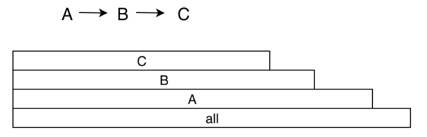

### CPU 时间

1. 用户时间：执行用户态应用程序代码所消耗的时间
2. 系统时间：执行内核态系统调用所消耗的时间，包括 I/O、锁、中断以及其他系统调用的时间。

**获取设备的 CPU 信息**

```
// 获取CPU核心数
cat /sys/devices/system/cpu/possible

// 获取CPU的频率
cat /sys/devices/system/cpu/cpu0/cpufreq/cpuinfo_max_freq
```

#### 卡顿问题分析指标

1. 查看 CPU 的使用率
   1. 通过/proc/stat 得到整个系统 CPU 的使用情况
   2. 通过/proc/[pid]/stat 得到某个进程的 CPU 使用情况

```
proc/self/stat:
  utime:       用户时间，反应用户代码执行的耗时
  stime:       系统时间，反应系统调用执行的耗时
  majorFaults：需要硬盘拷贝的缺页次数
  minorFaults：无需硬盘拷贝的缺页次数
```

2. CPU 饱和度：反映的事线程排队等待 CPU 的情况，也就是 CPU 的负载情况
   1. 启动的线程过多导致不断切换执行的线程，每次切换都需要刷新寄存器和计数器
   2. 通过/proc/[pid]/schedstat 文件来查看 CPU 上下文切换次数
   3. 可以通过 uptime 命令检查 CPU 在一分钟，五分钟和 15 分钟内的平均负载。
   4. 另一个影响 CPU 饱和度的事线程优先级，线程优先级会影响 Android 系统的调度策略。nice 和 cgroup 值共同决定，nice 值越低，抢占 CPU 时间片的能力越强。

> 是否存在高优先级的线程空等待低优先级线程，例如主线程等待某个后台线程的锁。

```
proc/self/sched:
  nr_voluntary_switches：
  主动上下文切换次数，因为线程无法获取所需资源导致上下文切换，最普遍的是 IO。
  nr_involuntary_switches：
  被动上下文切换次数，线程被系统强制调度导致上下文切换，例如大量线程在抢占 CPU。
  se.statistics.iowait_count：IO 等待的次数
  se.statistics.iowait_sum：  IO 等待的时间
```

**常用命令**

1. top 查看哪个进程是 CPU 的消耗大户
2. vmstat 实时动态监视操作系统的虚拟内存和 CPU 活动
3. strace 跟踪某个进程中所有系统调用

### Android 卡顿排查工具

**两个流派**

1. instrument。获取一段时间内所有函数的调用过程，分析一段时间内函数的调用流程。
2. sample 抽样的方式观察某些函数的调用过程。

**工具介绍**

1. Traceview
2. Nanoscope 修改 Android 虚拟机源码，在 ArtMethod 执行入口和结束位置增加埋点代码，将所有的信息先写到内存，等到 trace 结束，统一生成结果文件。
3. systrace 跟踪系统的 I/O 操作、CPU 负载、Surface 渲染、GC 等事件。

> 在 systrace 上面自动增加应用程序的耗时分析？
> 在重要的函数的入口和出口分别增加 Trace.beginSection 和 Trace.endSection

4. Simpleperf Android5.0 可以看到所有的 Native 代码的耗时。

Simplepref 支持 java 代码的性能分析，分为如下几个阶段：

1. 在 Android M 和以前，simplepref 不支持代码分析
2. 在 Android O 和以前，需要手动指定编译 OAT 文件
3. 在 Android P 和以后，无需做任何事情，SimplePref 就可以支持 Java 代码分析。

> 1. 如果需要分析 Native 代码的耗时，可以选择 Simplepref
> 2. 如果想分析系统调用，可以选择 systrace
> 3. 如果想分析整个程序执行流程的耗时，可以选择 Traceview 或者插桩版本的 systrace。

### Android 3.2 的 profiler 集成的性能分析工具

1. Sample JavaMethods 的功能类似于 TraceView 的 sample 类型
2. Trace Java Methods 的功能类似于 Traceview 的 instrument 类型
3. Trace System Calls 的功能类似于 systrace
4. SampleNative 的功能类似于 Simplepref。

### 展示方式

1. Call Chart：是 TraceView 和 systrace 默认使用的展示方式，按照应用程序的函数执行顺序来展示，适合用于分析整个流程的调用。

   

2. Flame Chart

   
