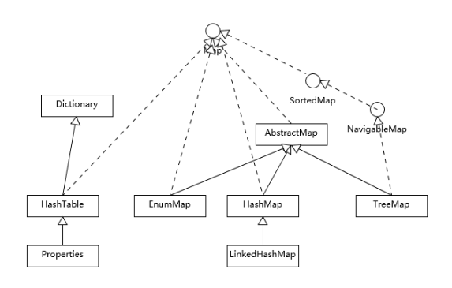

**HashTable**

1. 哈希表实现
2. 是线程同步的
3. 不支持 null 键和 null 值

**HashMap**

1. 哈希表实现
2. 不是线程同步的
3. 支持 null 键和 null 值
4. 是存储键值对的首选

**LinkedHashMap**

1. 提供遍历顺序符合插入顺序
2. 实现是通过为条目维护一个双向链表

**TreeMap**

1. 基于红黑树实现，提供顺序访问
2. 顺序是由键的顺序关系决定的，通过Comparator或Comparable来决定

> HashMap的性能表现非常依赖于哈希码的有效性，要掌握hashCode和equals的一些基本约定。

1. equals相等，hashCode一定要相等
2. 重写hashCode，也要重写equals
3. equals的对称、反射、传递等特性
4. hashCode需要保持一致性，状态改变返回的哈希值仍然要一致。

### HashMap源码分析

