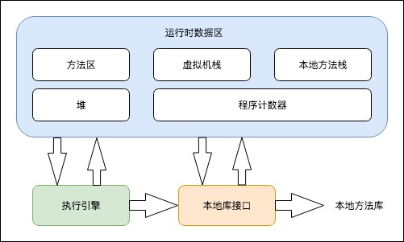
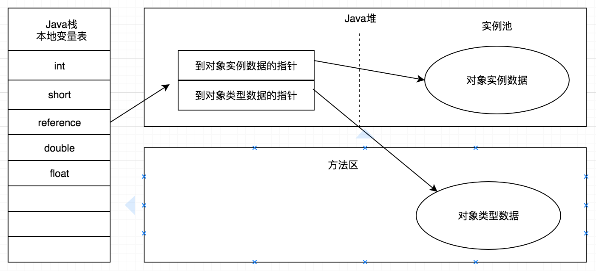

### 程序计数器

1. 是一块较小的内存空间
2. 是当前线程所执行的字节码的行号指示器
3. java 虚拟机的多线程是通过线程轮流切换并分配处理  器执行时间的方式来实现的，在任何一个确定的时刻，一个处理器都只会执行一条线程中的指令，因此， 为了线程切换能恢复到正确的执行位置，每条线程都需要有一个独立的程序计数器。
4. 程序计数器为线程私有的内存
5. 如果执行的是 java 字节码，记录的就是正在执行的虚拟机字节码指令的地址；如果正在执行的是 Native 方法，这个计数器值则为空。
6. 该区域是 java 虚拟机规范中没有规定任何 OutOfMemoryError 情况的区域。

### Java 虚拟机栈

1. 线程私有的，生命周期与线程相同
2. 虚拟机栈描述的是 Java 方法执行的内存模型
3. 每个方法在执行的同时都会创建一个栈帧用于存储局部变量表 、操作数栈、动态链接、方法出口等信息。
4. 每一个方法从调用直至完成的过程，就对应着一个栈帧在虚拟机栈中入栈到出栈的过程。

#### 局部变量表

1. 存放了编译器可知的各种基本数据类型(boolean、byte、char、short、int、float、long、double)、对象引用和 returnAddress 类型。
2. 局部变量表所需的内存空间在编译期间完成分配，当进入一个方法时，这个方法需要在帧中分配多大的局部变量空间时完全确定的。
3. 在方法运行期间不会改变局部变量表的大小。
4. 如果线程请求的栈深度大于虚拟机所允许的深度，将抛出 StackOverFlowError 异常；如果虚拟机无法申请到足够的内存，就会抛出 OutOfMemoryError 异常。

### 本地方法栈

1. 本地方法栈为虚拟机使用到的 Native 方法服务
2. 本地方法栈也会抛出 StackOverflowError 和 OutOFMemoryError 异常

### java 堆

1. java 堆是 java 虚拟机所管理的内存中最大的一块
2. 是被所有线程共享的  一块内存区域
3. 在虚拟机启动时创建，此区域的唯一目的是存放对象实例。
4. java 堆是垃圾收集器管理的主要区域
5. java 堆还可以细分为：新生代和老年代；再细致一点的有 Eden 空间、From Survivor 空间、To Survivor 空间等。

### 方法区

1. 与 java 堆一样事各个线程共享的内存区域
2. 用于存储已被虚拟机加载的类信息，常量，静态变量，即时编译器编译后的代码等数据。
3. 该区域的内存回收目标主要是针对常量池的回收和堆类型的卸载。

#### 运行时常量池

1. 是方法区的一部分
2. 用于存放编译器生成的各种字面量和符号引用，这部分内容将在类加载后进入方法区的运行时常量池中存放。
3. 常量池无法再申请到内存时会抛出 OutOfMemory 异常。

### 直接内存

1. 不是虚拟机运行时数据区的一部分，也不是 Java 虚拟机规范中定义的内存区域。
2. 也可能导致 OutOfMemoryError 异常
3. 直接内存不会受到 java 堆大小的限制。

### 虚拟机对象

#### 对象的创建

1. 遇到一个 new 指令，首先去检查这个指令的参数是否能在常量池中定位到一个类的符号引用。
2. 接着检查该符号引用代表的类是否已被加载、解析和初始化过，如果没有，那必须先执行相应的类加载过程。
3. 类  检查通过后，接下来虚拟机将为新生的对象分配内存，对象所需内存的大小在类加载完成后便可完全确定。
4. 内存分配完成后，虚拟机需要将分配的内存空间都初始化为零值。
5. 执行完 new 指令之后会直接执行\<init\>方法
   > 对于内存分配有两种方式：
   >
   > 1. 对于规整的内存，所有用过的内存放一边，空闲的内存放在另一边，中间放着一个指针作为分界点的指示器，那所分配的内存就是  把指针向空闲空间挪动一段与对象大小相等的距离，这种分配方式称为**指针碰撞**
   > 2. 对于不规整的内存,已使用的内存和空闲的内存相互交错，就没办法进行指针碰撞了，虚拟机就必须维护一个列表，记录哪些内存块是可用的，在分配的时候从列表中找到一块足够大的空间划分给对象实例，并更新列表上的记录，这种分配方式称为**空闲列表**

> 问题：正在给对象 A 分配内存，指针还没来得及修改，对象 B 又同时使用了原来的指针来分配内存的情况。

解决方案有两种：

1. 对分配内存空间的动作进行同步处理——实际上虚拟机采用 CAS 配上失败重试的方式保证更新操作的原子性。
2. 把内存分配的动作按照线程划分在不同的空间之中进行，即每个线程在 Java 堆中预先分配一小块内存，称为本地线程分配缓冲(TLAB),哪个线程要分配内存，就在哪个线程的 TLAB 上分配，只有 TLAB 用完并分配新的 TLAB 时，才需要同步锁定。

#### 对象的内存布局

在 HotSpot 虚拟机中，对象在内存中存储的布局可以分为 3 块区域：

1. 对象头

   1. 第一部分用于存储对象自身的运行时数据
   2. 第二部分是类型指针，即对象指向它的类元数据的指针，虚拟机通过这个指针来确定这个对象是哪个类的实例

2. 实例数据：对象真正存储的有效信息，也是在程序代码中所定义的各种类型的字段内容。
3. 对齐填充：不是必然存在的，也没有特别的  含义，仅仅起着占位符的作用。

#### 对象的访问定位

1. 主流的访问方式有使用**句柄**和**直接  指针**两种。
2. 如果使用句柄访问的话，java 堆中将划分出一块内存来作为句柄池，reference 中存储的就是对象的句柄地址，而句柄中包含了对象实例数据与类型数据各自的具体地址信息。

   

3.使用指针访问，那么 Java 堆对象的布局中就必须考虑如何放置访问类型数据的相关信息，而 reference 中存储的直接就是对象地址。

使用句柄访问的最大好处是 reference 中存储的事稳定的句柄地址，在对象被移动时只会改变句柄中的实例数据指针，而 reference 本身不需要修改。

使用直接指针访问方式的最大好处就是速度更快，他节省了一次指针定位的时间开销。

### Java 堆溢出

java 堆用于存储对象实例，只要不断的创建对象，并且保证 GC Roots 到对象之间与可达路径来避免垃圾回收机制清除这些对象，那么在对象数量到达最大堆的容量限制后就会产生内存溢出异常。

### 方法区与运行时常量池溢出

> String.intern()是一个Native方法，他的作用是：如果字符串常量池中已经包含一个等于此String对象的字符串，则返回代表池中这个字符串的String对象；否则将此String对象包含的字符串添加到常量池中，并且返回此String对象的引用。

1. JDK1.6及以前的版本中，常量池分配在永久代内，可以通过-XX:PermSize和-XX:MaxPermSize限制方法区的大小，从而间接限制其中常量池的容量。